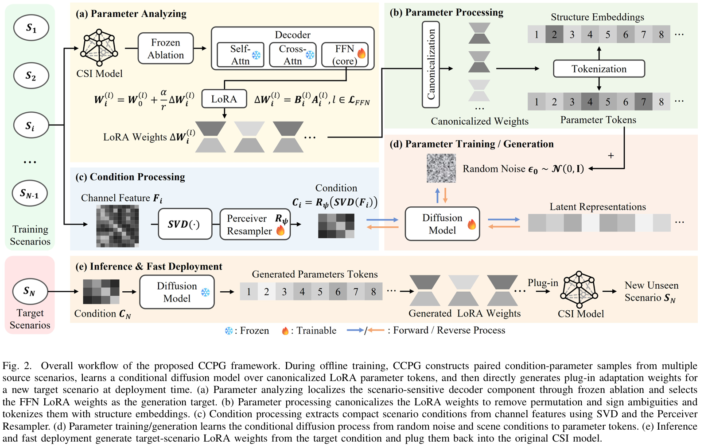

# CCPG

This repository contains the official implementation of **CCPG** for conditional LoRA parameter generation with diffusion transformers.

## Overview

CCPG models LoRA parameters as token sequences and generates them from condition features. The codebase includes:

- a Perceiver-style resampler for compressing condition features;
- a DiT denoiser with timestep, position, layer, and matrix embeddings;
- a Gaussian diffusion module supporting DDPM/DDIM sampling and classifier-free guidance;
- training, validation, checkpointing, visualization, and inference pipelines.



## Repository Structure

```text
.
├── configs/
│   └── config.yaml          # Default configuration template
├── core/
│   ├── trainer.py           # Training and validation loop
│   └── inferencer.py        # Checkpoint loading and generation
├── data/
│   └── dataloader.py        # LoRA dataset and dataloader
├── models/
│   ├── ddpm.py              # Gaussian diffusion and DDIM/DDPM sampling
│   ├── dit.py               # Diffusion Transformer denoiser
│   └── resampler.py         # PerceiverResampler and SimpleResampler
├── scripts/
│   ├── train.sh             # Example training script
│   └── inference.sh         # Example inference script
├── utils/
│   ├── scheduler.py         # Learning-rate schedulers
│   ├── tools.py             # Logger, seed, EMA, experiment directories
│   └── visualize.py         # Training/validation plots
└── main.py                  # Entry point
```

## Environment

The project is written in Python and PyTorch. A CUDA GPU is recommended for training.

```bash
conda create -n ccpg python=3.10 -y
conda activate ccpg

# Install PyTorch according to your CUDA version:
# https://pytorch.org/get-started/locally/

pip install omegaconf tqdm tensorboard matplotlib seaborn scipy pandas numpy
```

If your environment does not already include PyTorch, install a matching version first, for example:

```bash
pip install torch torchvision torchaudio
```

## Data Preparation

### Training Data

#### Datasets
[WAIR-D](https://www.mobileai-dataset.com/html/default/yingwen/DateSet/1590994253188792322.html?index=1&language=en)

[DeepMIMO](https://www.deepmimo.net/)


Set `data.data_dir` in `configs/config.yaml` to the training data root. The expected directory layout is:

```text
path/to/data_dir/
├── seed_0001/
│   ├── sample_0001.pth
│   └── sample_0002.pth
├── seed_0002/
│   └── sample_0001.pth
└── ...
```

### Statistics File

Set `data.stats_path` to a `.pth` file used for inverse normalization during inference.

### Inference Conditions

Set `inference.cond_path` to either a single `.pth` file or a directory containing `.pth` files. Each condition file should contain:

```python
{
    "cond": Tensor,  # shape: (cond_len, cond_dim)
    "mask": Tensor,  # shape: (cond_len,)
}
```

If `cond_path` is a directory, the inference script recursively processes all `.pth` files and preserves the relative paths under `inference.output_dir`.

## Configuration

Edit `configs/config.yaml` before running experiments:

```yaml
data:
  data_dir: path/to/data_dir
  stats_path: path/to/stats.pth
  device: cuda:0

exp_dir: path/to/exp_dir

inference:
  checkpoint_path: path/to/checkpoint.pth
  cond_path: path/to/conditions
  output_dir: path/to/output_dir
```

Important fields:

- `data.token_size`: token length used to flatten LoRA matrices.
- `data.cond_shape`: condition feature shape `[cond_len, cond_dim]`.
- `data.original_shapes`: original matrix shapes used for tokenization and reconstruction.
- `resampler.latent_cond_len`: number of latent condition tokens after resampling.
- `diffusion.timesteps`: number of diffusion steps for training.
- `diffusion.prediction_type`: one of `eps`, `x`, or `v`.
- `train.batch_size`: batch size per optimization step.
- `train.grad_accum_steps`: gradient accumulation steps.
- `train.cfg_drop_rate`: condition dropout probability for classifier-free guidance.
- `train.ema_rate`: EMA decay used for validation and inference.
- `lr_scheduler.type`: one of `const`, `cosine`, `cosine_warmup`, or `cosine_restart`.
- `inference.use_ddim`: whether to use DDIM sampling.
- `inference.ddim_steps`: number of DDIM sampling steps.
- `inference.cfg_scale`: classifier-free guidance scale.

Optional ablation settings can be enabled as:

```yaml
ablation:
  - structure    # remove layer/matrix structure embeddings
  - size_aware   # remove size-aware loss behavior
  - resampler    # use SimpleResampler instead of PerceiverResampler
```

## Training

Run training with:

```bash
export PYTHONPATH=$PYTHONPATH:$(pwd)
python main.py --config configs/config.yaml --mode train
```

You can also use the shell script after updating `config_path` inside it:

```bash
bash scripts/train.sh
```

Training creates the following files under `exp_dir`:

```text
exp_dir/
├── logs/
│   ├── config.yaml          # Saved copy of the active config
│   ├── output.log           # Runtime log
│   └── events.out.tfevents* # TensorBoard logs
├── ckpts/
│   └── best.pth             # Best validation checkpoint
└── results/
    ├── diff/                # Prediction error distribution plots
    ├── heatmap/             # Prediction/target heatmaps
    └── hist/                # Prediction/target histograms
```

View TensorBoard logs with:

```bash
tensorboard --logdir path/to/exp_dir/logs
```

## Inference

First update the inference section in the config:

```yaml
inference:
  seed: 3407
  use_ema: true
  checkpoint_path: path/to/exp_dir/ckpts/best.pth
  cond_path: path/to/conditions
  cfg_scale: 1.0
  use_ddim: true
  ddim_steps: 50
  eta: 1.0
  output_dir: path/to/output_dir
```

Then run:

```bash
export PYTHONPATH=$PYTHONPATH:$(pwd)
python main.py --config configs/config.yaml --mode inference
```

Generated files are saved as `.pth` dictionaries.